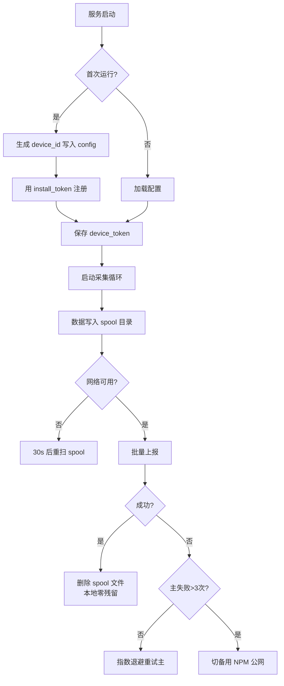
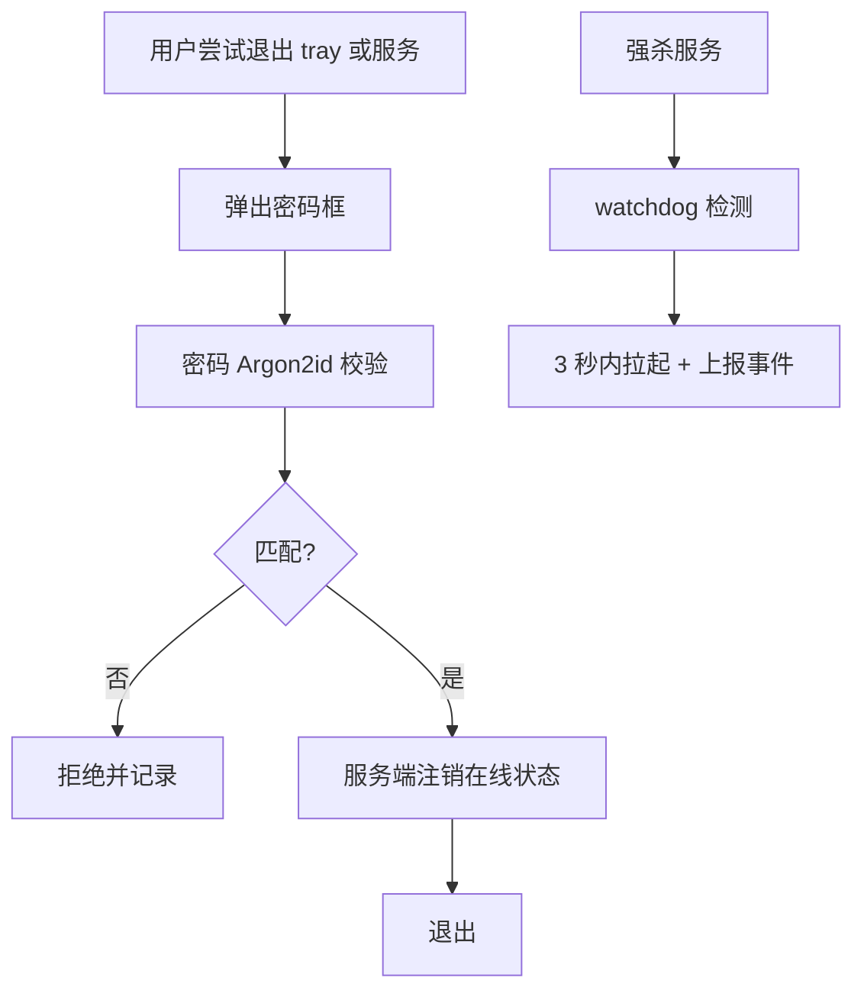
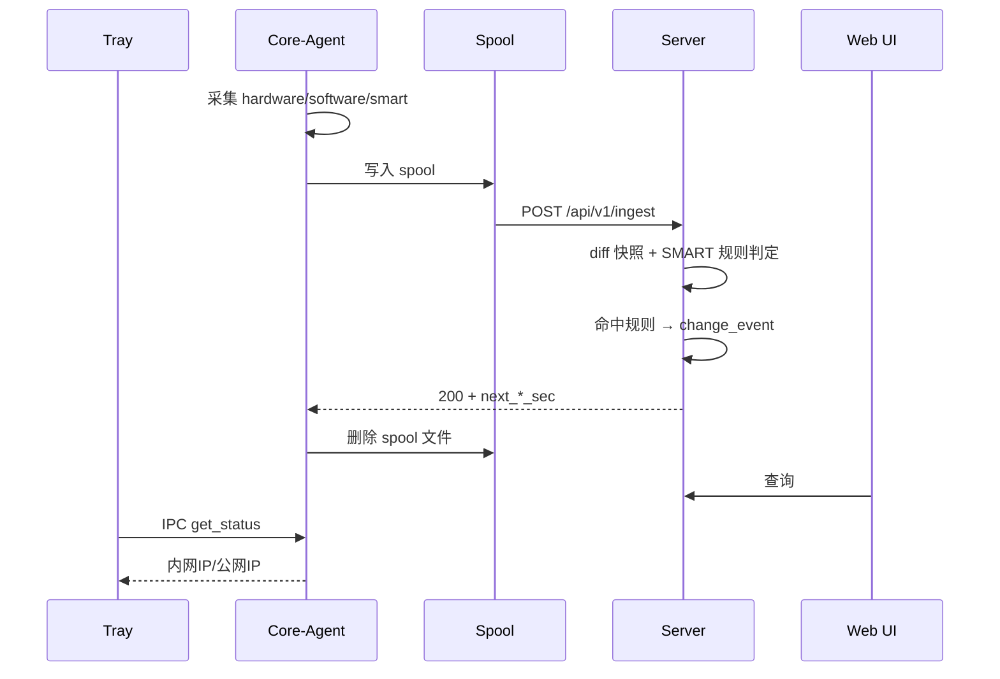

# IT Agent 技术方案设计文档

**版本**：v1.1
**工作区**：E:\ai_work\trae\itagent
**目标规模**：东莞 536 + 苏州 89 + macOS 47（持续增长）≈ 672 终端，预留 2000 台余量
**适用平台**：Windows 10/11（主）、macOS 12+（次）

---

## 1. 总体架构

```
┌──────────────────────────── Windows / macOS 终端 ────────────────────────────┐
│                                                                              │
│  tray (用户态托盘)          core-agent (系统服务/守护进程)                   │
│  ┌───────────────┐ IPC    ┌──────────────────────────────────┐               │
│  │ 悬停气泡 UI   │◄──────►│ collector   hardware/os/software │               │
│  │ 内网IP/公网IP │        │             /SMART               │               │
│  │ 退出需密码    │        │ reporter    本地队列+断点重传     │               │
│  └───────────────┘        │ watchdog    服务守护/自修复       │               │
│                           │ config      主备server/密钥管理   │               │
│                           └───────────────┬──────────────────┘               │
└───────────────────────────────────────────┼──────────────────────────────────┘
                                            │
                ┌──────────── 内网直连（优先） ───────────┐
                ▼                                         ▼
   ┌──────────────────────┐                ┌──────────────────────────┐
   │ 主服务器 (内网)      │   数据同步     │ 备用服务器               │
   │ agent.it.local:8443  │ ◄───────────── │ NPM反代: agent.xxx.com   │
   │ ├ ingest API         │  (rsync/每晚)  │ (腾讯云香港 + NPM)       │
   │ ├ 变更告警引擎       │                │ 只读 ingest 转发/直写    │
   │ ├ SMART 健康预警     │                └──────────────────────────┘
   │ ├ Web 管理界面       │
   │ ├ Webhook 通知(预留) │
   │ └ Snipe-IT 连接器    │
   └──────────────────────┘
```

**双服务器策略**
- Agent 配置主备两个地址，默认主（内网）
- 主地址连续失败 3 次（含超时）→ 切备用，切换状态落盘持久
- 备用连通后每 30 分钟探测主服务器一次，恢复即回切
- 备用服务器只做 ingest 转发到主库，非接入高峰不承载 UI

---

## 2. 技术选型

| 层 | 选型 | 说明 |
|---|------|------|
| Agent 语言 | Go 1.22+ | 单文件、跨平台、原生并发 |
| Agent-Windows API | WMI (go-ole / 内置调用) + registry | 采集主力 |
| Agent-macOS API | `system_profiler -json` + `sysctl` + `/Applications` | shell out 封装 |
| 托盘 | getlantern/systray | 跨平台、无外部依赖 |
| 本地队列 | 文件 spool 目录（JSON 文件，成功即删） | 零依赖、断电安全、本地零残留 |
| IPC | Windows: named pipe `\\.\pipe\itagent`；macOS: unix socket `/var/run/itagent.sock` | 托盘 <-> core-agent |
| 服务端框架 | Go 标准库 net/http（v1） | 零外部依赖，后续可升 Gin |
| 服务端存储 | SQLite (modernc.org/sqlite 纯 Go) → PostgreSQL / MySQL（>1500台或接 Snipe-IT 深度集成时切换） | 按规模升级，见 2.1 |
| 服务端 UI | Vue3 + Element Plus（构建后嵌入 Go 二进制） | 运维友好 |
| 部署 | Windows: 安装脚本 + `sc.exe create`；macOS: .pkg + LaunchDaemon plist | |

### 2.1 数据库平滑迁移设计（SQLite → PostgreSQL / MySQL）

- **代码层**：所有读写走 `internal/server/store` 的 `Store` 接口（RegisterDevice/Authenticate/SaveReport/查询族）。
  SQLite 实现为 `SQLiteStore`；未来新增 `PGStore`（pgx）/ `MySQLStore`（go-sql-driver/mysql），业务代码零改动。
- **约束**：Store 方法只定义业务语义，不暴露 SQL；分页统一 limit/offset；错误统一 `ErrNotFound/ErrUnauthorized`。
- **schema 兼容**：表结构保持三种引擎方言兼容（TEXT/INT/DATETIME 基础类型，无 SQLite 特有函数），迁移工具 `migrate` 子命令按表导出导入。
- **切换方式**：`server.json` 增加 `db_driver: sqlite|postgres|mysql` + `db_dsn`，停机窗口内跑迁移工具 → 改配置 → 重启。
- **迁移触发点**：>1500 台、高并发 UI 查询、或需要与 Snipe-IT/MySQL 报表体系联表时。

---

## 3. 目录结构

```
itagent/
├── cmd/
│   ├── core-agent/          # 后台服务入口
│   │   └── main.go
│   ├── tray/                # 托盘入口
│   │   └── main.go
│   └── server/              # 服务端入口
│       └── main.go
├── internal/
│   ├── agent/
│   │   ├── collector/
│   │   │   ├── collector.go         # 接口定义
│   │   │   ├── hardware_windows.go
│   │   │   ├── hardware_darwin.go
│   │   │   ├── osinfo_windows.go
│   │   │   ├── osinfo_darwin.go
│   │   │   ├── software_windows.go
│   │   │   ├── software_darwin.go
│   │   │   └── smart.go             # SMART 采集
│   │   ├── reporter/
│   │   │   ├── spool.go             # 文件队列（成功即删）
│   │   │   ├── uploader.go          # 上报+主备切换
│   │   │   └── backoff.go           # 指数退避
│   │   ├── watchdog/
│   │   │   ├── service_windows.go
│   │   │   └── daemon_darwin.go
│   │   ├── ipc/
│   │   │   ├── server_windows.go
│   │   │   └── server_darwin.go
│   │   └── config/
│   │       └── config.go            # 配置文件+服务端下发覆盖
│   ├── tray/
│   │   ├── ui.go
│   │   └── password.go
│   ├── server/
│   │   ├── api/
│   │   │   ├── ingest.go
│   │   │   ├── register.go
│   │   │   └── query.go
│   │   ├── alert/
│   │   │   ├── diff.go              # 快照对比（数量/序列号变更）
│   │   │   └── smart.go             # SMART 健康规则
│   │   ├── store/
│   │   │   ├── models.go
│   │   │   └── migrations.go
│   │   ├── connector/
│   │   │   └── snipeit.go           # 预留
│   │   └── ui/
│   └── shared/
│       ├── protocol/
│       │   └── types.go
│       └── crypto/
├── configs/
│   ├── agent.json                   # Agent 默认配置
│   └── server.json                  # 服务端配置（含告警阈值）
├── web/                             # 前端源码
├── scripts/
│   ├── install_windows.ps1
│   ├── install_macos.sh
│   └── uninstall_windows.ps1
├── deploy/
│   ├── server/docker-compose.yml
│   └── agent/
├── docs/
│   └── architecture.md              # 本文档
├── go.mod
└── Taskfile.yml
```

---

## 4. 核心数据协议

### 4.1 设备身份

```
device_id = sha256( motherboard_serial + first_mac )[:16]
```
- Windows `Win32_BaseBoard.SerialNumber`、`Win32_NetworkAdapter.MACAddress`
- macOS `ioreg -rd1 -c IOPlatformExpertDevice` 取 `IOPlatformUUID`
- 首次启动生成后写入本地 `config.dat`，不再变化
- 服务端用 device_id 作为数据主键

**主机序列号采集（多来源容错）**
- `Win32_ComputerSystemProduct.IdentifyingNumber`（首选）+ `Win32_BIOS.SerialNumber`（备选，`bios_serial` 字段）
- 组装机常见垃圾值（`Default string` / `To be filled by O.E.M.` / `System Serial Number` 等）服务端过滤
- macOS：`IOPlatformSerialNumber`

**最后登录用户采集（AD + 本地混合场景）**
- 心跳内携带 `logon`：`logon_user` / `logon_domain` / `logon_type`（`ad`|`local`）/ `logon_at`
- Windows 来源：`Win32_ComputerSystem.UserName`（当前登录者，自带 `DOMAIN\user`）+ LogonUI 注册表（`LastLoggedOnUser`，含已注销者）补 `logon_at`
- `logon_type` 判定：`logon_domain` 命中服务端配置的域名清单 → `ad`，否则 `local`（笔记本未加域场景自动正确）
- macOS：`last` 命令取最后登录，统一 `local`

### 4.2 上报报文（统一格式）

```
POST /api/v1/ingest
Authorization: Bearer <device_token>

{
  "device_id": "a1b2c3d4e5f60708",
  "agent_version": "1.0.0",
  "report_type": "full | heartbeat",
  "reported_at": "2026-09-04T10:23:45+08:00",
  "payload": { ... }
}
```

**heartbeat**：
```json
{
  "hostname": "DG-FIN-0231",
  "os": {"name":"Windows 11 Pro","version":"23H2","build":"22631.4168"},
  "logon": {"logon_user":"zhangsan","logon_domain":"DG","logon_type":"ad","logon_at":"2026-09-04T08:05:11+08:00"},
  "boot_time": "2026-09-04T08:12:00+08:00",
  "uptime_sec": 7865,
  "network": {
    "interfaces": [
      {"name":"以太网","mac":"AA:BB:CC:DD:EE:01","ips":["10.8.12.34/24"],"is_up":true}
    ],
    "public_ip": "120.24.36.18"
  }
}
```

**full**：在 heartbeat 基础上扩展 hardware + software + SMART：

```json
{
  "hardware": {
    "brand": "Dell Inc.",
    "model": "OptiPlex 7010",
    "serial": "7XKQ1P3",
    "bios_serial": "7XKQ1P3",
    "cpu": [{"model":"Intel Core i7-13700","cores":16,"threads":24}],
    "memory_total_mb": 32768,
    "memory_modules": [
      {"slot":"DIMM1","size_mb":16384,"type":"DDR5","speed_mhz":5600,"serial":"A1B2C3"}
    ],
    "disks": [
      {"model":"Samsung SSD 990 PRO 1TB","size_gb":1000,"type":"NVMe","serial":"S6Y4NY0W123456","removable":false}
    ],
    "gpus": [{"model":"NVIDIA RTX 4060","vram_mb":8192}],
    "nics": [{"name":"Intel I225-V","mac":"AA:BB:CC:DD:EE:01","speed_mbps":2500}],
    "disk_smart_health": [
      {"disk_serial":"S6Y4NY0W123456","model":"Samsung SSD 990 PRO 1TB","overall_health":"PASSED",
       "reallocated_sectors":0,"pending_sectors":0,"power_on_hours":12345,
       "temperature_c":41,"percent_lifetime_used":12}
    ]
  },
  "software": [
    {"name":"Microsoft Office LTSC 2024","version":"16.0.14332.20456","install_path":"C:\\Program Files\\Microsoft Office"}
  ]
}
```

### 4.3 服务端响应

```json
{
  "code": 0,
  "message": "ok",
  "server_time": "2026-09-04T10:23:46+08:00",
  "next_heartbeat_sec": 600,
  "next_full_sec": 3600
}
```

- `5xx` / `401` / `403` 触发重试；`200` 才删除本地 spool 文件（**本地零残留**）。
- `next_*_sec` 支持服务端动态调整采集节奏。

### 4.4 采集频率（可配置，非硬编码）

| 参数 | 默认值 | 说明 |
|------|--------|------|
| `heartbeat_interval_sec` | 600（10 分钟） | 心跳上报间隔 |
| `full_interval_sec` | 3600（60 分钟） | 全量采集间隔 |
| `spool_scan_sec` | 30 | 离线队列扫描间隔 |
| `failover_probe_sec` | 1800 | 备用链路下探测主服务器间隔 |

优先级：**服务端下发 > 本地配置文件 > 内置默认**。服务端响应中的 `next_*_sec` 覆盖本地。

### 4.5 注册流程

```
agent: 无 token → POST /api/v1/register
        body: { device_id, hostname, os, agent_version, install_token }
server: 校验 install_token → 签发 device_token 返回
agent: 持久化 device_token，后续上报走 Bearer
```

---

## 5. 变更告警规则（v1.1 修订）

**告警范围（白名单，仅以下进入变更中心）**：
- 磁盘、内存、CPU、GPU、网卡的**数量增减**
- 磁盘/内存的**序列号更换**（同数量换件也能发现）
- 品牌机型号/SN 变更

**不告警（仅采集展示）**：
- SMART 读写次数、通电小时数、温度等动态指标
- 可移动磁盘（U 盘）拔插
- 软件安装明细（量大，先进历史，不告警）

**SMART 健康预警规则（服务端可配置阈值）**：

| 条件 | 级别 |
|------|------|
| `reallocated_sectors > 0` | 警告 |
| `pending_sectors > 0` | 严重 |
| `overall_health != PASSED` | 紧急 |
| `percent_lifetime_used >= 80` | 提示轮换 |
| `temperature_c >= 60`（持续 3 次采样） | 警告 |

Web UI 设备卡片显示磁盘健康红绿灯；变更中心独立"健康预警"页签。

---

## 6. 关键流程

### 6.1 Agent 启动



### 6.2 防卸载 / 退出密码



### 6.3 数据流



## 6.5 边界声明：不要做成准入设备

**Agent 不做 NAC**。你现有链路上已有专用准入/在网行为设备：

```
无线上行 → 信锐 NMC6820（802.1X/Portal/MAC 认证，准入是它的本职）
有线 → 接入交换机 → 核心 → 深信服 AC（在线式，原生阻断）→ 奇安信防火墙
```

正确分工：
- **Agent = 上报健康状态**（杀软/补丁/屏幕锁/硬盘加密/硬件变更）
- **服务端 = 合规评分 + 判定**，坐决策
- **信锐 / 深信服 = 执行点**，拿到决策后把自己的黑名单改了

为什么 Agent 不适合准入：
1. 先有鸡先有蛋：agent 要有网才能上报，如果该拦它已经拦不住了
2. 本地可绕过（本机管理员权限就能撤）
3. 信锐 NMC6820 和深信服 AC 原生能干这事，Agent 去做是重复造轮子

**所以集成的 correct 姿势是**：服务端加 `/api/v1/posture/{device_id}` 供网络设备/深信服拉，或事件 webhook 推给信锐。

---

## 7. 服务端 API 清单

| 方法 | 路径 | 说明 | 认证 |
|------|------|------|------|
| POST | `/api/v1/register` | 设备注册 | install_token |
| POST | `/api/v1/ingest` | 数据上报 | device_token |
| GET | `/api/v1/agent/config` | Agent 拉配置 | device_token |
| GET | `/api/v1/devices` | 设备列表 | 管理员 |
| GET | `/api/v1/devices/{id}` | 设备详情 | 管理员 |
| GET | `/api/v1/devices/{id}/history` | 上报历史 | 管理员 |
| GET | `/api/v1/changes` | 变更事件列表 | 管理员 |
| POST | `/api/v1/changes/{id}/ack` | 标记已读 | 管理员 |
| POST | `/api/v1/assets/sync-snipeit` | Snipe-IT 同步 | 管理员 |

---

## 8. Agent 自动更新与远程推送

### 8.1 自动更新

- **轮询模式**（不是服务端主动连终端）：Agent 每次心跳时服务端在响应中带 `update` 字段；Agent 检测到版本更高则自动升级
- **更新包协议**：
```json
"update": {
  "version": "1.2.0",
  "url": "http://server:8443/api/v1/files/pkg/core-agent-1.2.0.zip",
  "sha256": "…",
  "sign": "…",           // Ed25519 签名（v1.1 起强制）
  "mandatory": false
}
```
- **升级流程**：后台下载到临时目录 → 校验 sha256 + 签名 → 延迟任务替换二进制（Windows 无法替换运行中 exe，由 `updater` 辅助进程完成）→ 旧版退出 → updater 启动新版 → 新版上报自身版本 → 服务端确认灰度比例
- **灰度策略**：服务端按设备分组指定目标版本（`update_groups`：`canary` / `stable`），新版本先 5% → 观察 24h 无异常 → 全量
- **防砖**：新版本启动 10 分钟内必须成功注册一次上报否则自动回滚到备份副本（updater 保留旧二进制）

### 8.2 文件/脚本推送（远程任务）

- 管理端创建任务：`POST /api/v1/tasks`，类型：
  - `fetch_file`（上传一个文件到终端指定路径）
  - `run_script`（下发 PowerShell/PowerShell 7 bash 脚本执行）
  - `collect_file`（从终端取回一个日志/配置文件回服务器）
- 任务投递：Agent 心跳/全量响应里下发 `tasks[]`；Agent 执行后走 `/api/v1/tasks/{id}/ack` 回报结果（stdout 尾部 + exit code）
- **安全约束**：
  - 脚本必须经服务端签名校验（与更新包共用 Ed25519 密钥对）
  - 脚本 = 已知白名单模板的参数化调用（禁止自由文本脚本 v1.0；v1.1 开放自由脚本但需双管理员审批）
  - fetch_file 目标路径白名单（仅安装目录 / ProgramData\itagent\）
  - collect_file 来源白名单（日志目录、指定采集路径）
- **执行窗口限制**：默认只允许工作时间外运行高影响任务（域策略脚本除外）

### 8.3 与 ad-selfservice 的接口级集成

- 不合并代码库（Go ↔ Python），不共享数据库
- **通知通道**：itagent 告警 → POST ad-selfservice 内部 notify API（经管理员 token），复用已调通的企业微信通道
- **身份关联**：itagent 心跳带 `logon_domain\logon_user`；ad-selfservice 前端「员工资产」页按用户反查 itagent `/api/v1/devices?logon_user=<sam>`，实现人↔设备双向查询
- **运维入口统一**：ad-selfservice 管理后台加「IT 资产管理」菜单项，嵌入/跳转 itagent Web UI
- 两端数据库独立演进（各自 SQLite → PG/MySQL 变体），将来迁 PG 可考虑同实例不同 database，便于 DBA 统一备份

**网络暴露面对齐（沿用 ad-selfservice 的 S-6 模式）**：

| 系统 | 侧 | 公网（经 NPM） | 内网 |
|---|---|---|---|
| ad-selfservice | 员工 OAuth 改密 | ✅ `adp.samsuncn.net` | ✅ |
| ad-selfservice | 管理后台 + `/api/v1/admin/*` | ❌ ACL 拦截，伪装 404 | ✅ |
| itagent | Agent ingest/register/config（`/api/v1/*`） | ✅ `agent.samsuncn.net`（备用机） | ✅ |
| itagent | 管理 UI + 管理 API | ❌ ACL 拦截，伪装 404 | ✅ / VPN |
| 集成链路 | itagent → ad-selfservice notify API | 不走公网 | 内网直连 backend:8000 |

原则：**凡是带"管理"性质的入口一律仅内网**；公网只放"机器对机器"的 ingest 通道 + "员工自助"通道。公网上拿不到管理功能，攻击面只剩 ingest（本身有设备 token + 安装令牌双重把关）。

### 8.4 USB 移动存储管控（usbguard）

**策略矩阵**：

| 设备类别 | 默认策略 | 实现 |
|---|---|---|
| U盘/移动硬盘（USB Storage） | 按服务端策略：off / audit / read-only / block | 服务策略键 `USBSTOR Start=4` + `RemovableStorageDevices` 策略 |
| 手机便携存储（MTP/WPD） | 随 USB Storage 策略 | 禁 WPD 类 + wpdmtp |
| 鼠标/键盘/无线 nano 接收器 | 永远放行 | HID 类不动 |
| 无线传屏盒子 | 按 VID/PID 白名单放行 | Device Installation Restrictions |

**联动**：策略走 `agent/config` 下发的 `usb_policy` 字段；**移动介质插拔事件独立进变更中心的安全审计流**（与硬件变更白名单分离）；macOS 侧仅审计+企微预警，阻断需 MDM。

---

## 9. macOS 说明（47 台+，占比提升，优先级上调）

- 分发：`.pkg`（pkgbuild + productbuild，postinstall 注册 launchd）
- 自启动：`/Library/LaunchDaemons/com.company.itagent.plist`，`KeepAlive=true`
- SMART：`smartctl` 打包进安装包；内置磁盘可读
- 签名：v1.0 不签名，部署脚本附带 `xattr -cr`；正式化再申 $99 账号签名+notarize
- 防卸载：root 下无法阻止彻底卸载，在部署文档明确

---

## 9. 安全设计

1. 公网链路 TLS 1.2+，NPM 终止 TLS；内网可 HTTP
2. device_token 走 Header，本地 v1.0 明文 0400 权限，v1.1 DPAPI/Keychain
3. 退出/卸载密码仅存 Argon2id hash
4. NPM 只放通 `/api/v1/*`，管理 UI 仅内网/VPN
5. 最小采集：不采密码、文件内容、键盘、屏幕、浏览记录

---

## 11. 实施路线

| 阶段 | 内容 |
|------|------|
| P0 | 仓库初始化 + 服务端 ingest + SQLite + 简单查询 |
| P1 | Windows 采集 + spool + 上报 + 主备切换 |
| P2 | diff 引擎 + SMART 健康规则 + Web UI（设备/变更/健康预警） |
| P3 | Tray UI + 密码退出 + watchdog |
| P4 | 安装包 + 注册令牌 + 30 台试点（含 10 台 mac 同步开发） |
| P5 | Windows 全量推广 |
| P6 | macOS 全量推广（与 Windows 推广并行） |
| P7 | Snipe-IT 连接器 + 插件框架 + Webhook 通知（对接 ad-selfservice 企微通道） |
| P8 | Agent 自动更新（灰度+回滚）+ 远程文件/脚本推送任务 + ad-selfservice 人↔设备视图 |
