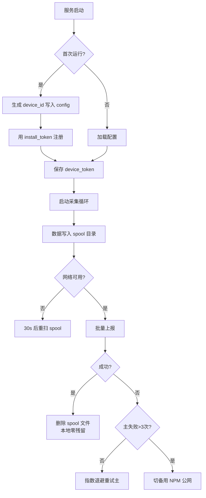
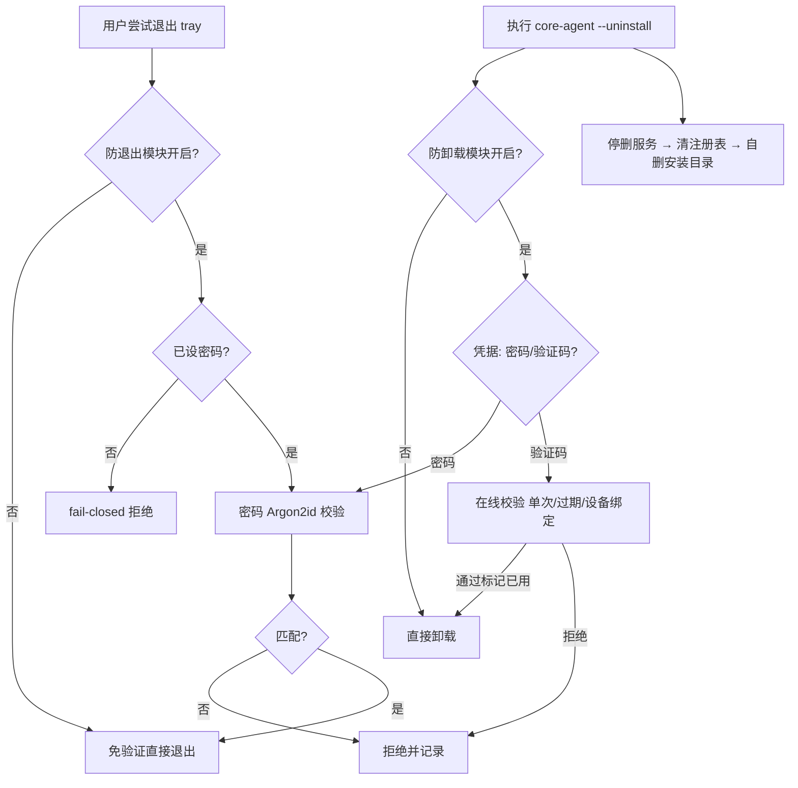
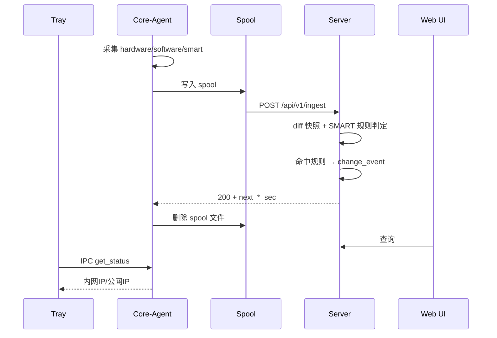

# IT Agent 技术方案设计文档

**版本**：v1.1
**工作区**：E:\ai_work\trae\itagent
**目标规模**：东莞 536 + 苏州 89 + macOS 47（持续增长）≈ 672 终端，预留 2000 台余量
**适用平台**：Windows 10/11（主）、macOS 12+（次）

---

## 1. 总体架构

```
┌──────────────────────────── Windows / macOS 终端 ────────────────────────────┐
│                                                                              │
│  tray (用户态托盘)          core-agent (系统服务/守护进程)                   │
│  ┌───────────────┐ IPC    ┌──────────────────────────────────┐               │
│  │ 悬停气泡 UI   │◄──────►│ collector   hardware/os/software │               │
│  │ 内网IP/公网IP │        │             /SMART               │               │
│  │ 退出需密码    │        │ reporter    本地队列+断点重传     │               │
│  └───────────────┘        │ watchdog    服务守护/自修复       │               │
│                           │ config      主备server/密钥管理   │               │
│                           └───────────────┬──────────────────┘               │
└───────────────────────────────────────────┼──────────────────────────────────┘
                                            │
                ┌──────────── 内网直连（优先） ───────────┐
                ▼                                         ▼
   ┌──────────────────────┐                ┌──────────────────────────┐
   │ 主服务器 (内网)      │   数据同步     │ 备用服务器               │
   │ agent.it.local:8443  │ ◄───────────── │ NPM反代: agent.xxx.com   │
   │ ├ ingest API         │  (rsync/每晚)  │ (腾讯云香港 + NPM)       │
   │ ├ 变更告警引擎       │                │ 只读 ingest 转发/直写    │
   │ ├ SMART 健康预警     │                └──────────────────────────┘
   │ ├ 超期/失联告警引擎 │ (A4: Ticker 扫描→Webhook)
   │ ├ 折旧规则引擎     │ (P0-β: 按规则定时刷资产净值)
   │ ├ Web 管理界面       │
   │ ├ Webhook 通知(预留) │ (P7 插件框架/IM 通道)
   │ └ Snipe-IT 连接器    │
   └──────────────────────┘
```

**双服务器策略**
- Agent 配置主备两个地址，默认主（内网）
- 主地址连续失败 3 次（含超时）→ 切备用，切换状态落盘持久
- 备用连通后每 30 分钟探测主服务器一次，恢复即回切
- 备用服务器只做 ingest 转发到主库，非接入高峰不承载 UI

---

## 2. 技术选型

| 层 | 选型 | 说明 |
|---|------|------|
| Agent 语言 | Go 1.22+ | 单文件、跨平台、原生并发 |
| Agent-Windows API | WMI (go-ole / 内置调用) + registry | 采集主力 |
| Agent-macOS API | `system_profiler -json` + `sysctl` + `/Applications` | shell out 封装 |
| 托盘 | getlantern/systray | 跨平台、无外部依赖 |
| 本地队列 | 文件 spool 目录（JSON 文件，成功即删） | 零依赖、断电安全、本地零残留 |
| IPC | Windows: named pipe `\\.\pipe\itagent`；macOS: unix socket `/var/run/itagent.sock` | 托盘 <-> core-agent |
| 服务端框架 | Agent 通道 net/http 标准库 mux + 管理 API Gin（v1，JWT 鉴权） | 双栈并存，见 §7 路由挂载约定 |
| 服务端存储 | GORM + MySQL/MariaDB（生产，AutoMigrate 建表）；SQLite 仅历史开发默认 | 切换记录见 git 历史 |
| 服务端 UI | Vue3 + Element Plus（构建后嵌入 Go 二进制） | 运维友好 |
| 部署 | Windows: 安装脚本 + `sc.exe create`；macOS: .pkg + LaunchDaemon plist | |

### 2.1 数据库平滑迁移设计（SQLite → PostgreSQL / MySQL）

- **代码层**：所有读写走 `internal/server/store` 的 `Store` 接口（RegisterDevice/Authenticate/SaveReport/查询族）。
  SQLite 实现为 `SQLiteStore`；未来新增 `PGStore`（pgx）/ `MySQLStore`（go-sql-driver/mysql），业务代码零改动。
- **约束**：Store 方法只定义业务语义，不暴露 SQL；分页统一 limit/offset；错误统一 `ErrNotFound/ErrUnauthorized`。
- **schema 兼容**：表结构保持三种引擎方言兼容（TEXT/INT/DATETIME 基础类型，无 SQLite 特有函数），迁移工具 `migrate` 子命令按表导出导入。
- **切换方式**：`server.json` 增加 `db_driver: sqlite|postgres|mysql` + `db_dsn`，停机窗口内跑迁移工具 → 改配置 → 重启。
- **迁移触发点**：>1500 台、高并发 UI 查询、或需要与 Snipe-IT/MySQL 报表体系联表时。

---

## 3. 目录结构

```
itagent/
├── cmd/
│   ├── core-agent/          # 后台服务入口
│   │   └── main.go
│   ├── tray/                # 托盘入口
│   │   └── main.go
│   └── server/              # 服务端入口
│       └── main.go
├── internal/
│   ├── agent/
│   │   ├── collector/
│   │   │   ├── collector.go         # 接口定义
│   │   │   ├── hardware_windows.go
│   │   │   ├── hardware_darwin.go
│   │   │   ├── osinfo_windows.go
│   │   │   ├── osinfo_darwin.go
│   │   │   ├── software_windows.go
│   │   │   ├── software_darwin.go
│   │   │   └── smart.go             # SMART 采集
│   │   ├── reporter/
│   │   │   ├── spool.go             # 文件队列（成功即删）
│   │   │   ├── uploader.go          # 上报+主备切换
│   │   │   └── backoff.go           # 指数退避
│   │   ├── watchdog/
│   │   │   ├── service_windows.go
│   │   │   └── daemon_darwin.go
│   │   ├── ipc/
│   │   │   ├── server_windows.go
│   │   │   └── server_darwin.go
│   │   └── config/
│   │       └── config.go            # 配置文件+服务端下发覆盖
│   ├── tray/
│   │   ├── ui.go
│   │   └── password.go
│   ├── server/
│   │   ├── api/
│   │   │   ├── ingest.go
│   │   │   ├── register.go
│   │   │   └── query.go
│   │   ├── alert/
│   │   │   ├── diff.go              # 快照对比（数量/序列号变更）
│   │   │   └── smart.go             # SMART 健康规则
│   │   ├── store/
│   │   │   ├── models.go
│   │   │   └── migrations.go
│   │   ├── connector/
│   │   │   └── snipeit.go           # 预留
│   │   └── ui/
│   └── shared/
│       ├── protocol/
│       │   └── types.go
│       └── crypto/
├── configs/
│   ├── agent.json                   # Agent 默认配置
│   └── server.json                  # 服务端配置（含告警阈值）
├── web/                             # 前端源码
├── scripts/
│   ├── install_windows.ps1
│   ├── install_macos.sh
│   └── uninstall_windows.ps1
├── deploy/
│   ├── server/docker-compose.yml
│   └── agent/
├── docs/
│   └── architecture.md              # 本文档
├── go.mod
└── Taskfile.yml
```

---

## 4. 核心数据协议

### 4.1 设备身份

```
device_id = sha256( motherboard_serial + first_mac )[:16]
```
- Windows `Win32_BaseBoard.SerialNumber`、`Win32_NetworkAdapter.MACAddress`
- macOS `ioreg -rd1 -c IOPlatformExpertDevice` 取 `IOPlatformUUID`
- 首次启动生成后写入本地 `config.dat`，不再变化
- 服务端用 device_id 作为数据主键

**主机序列号采集（多来源容错）**
- `Win32_ComputerSystemProduct.IdentifyingNumber`（首选）+ `Win32_BIOS.SerialNumber`（备选，`bios_serial` 字段）
- 组装机常见垃圾值（`Default string` / `To be filled by O.E.M.` / `System Serial Number` 等）服务端过滤
- macOS：`IOPlatformSerialNumber`

**最后登录用户采集（AD + 本地混合场景）**
- 心跳内携带 `logon`：`logon_user` / `logon_domain` / `logon_type`（`ad`|`local`）/ `logon_at`
- Windows 来源：`Win32_ComputerSystem.UserName`（当前登录者，自带 `DOMAIN\user`）+ LogonUI 注册表（`LastLoggedOnUser`，含已注销者）补 `logon_at`
- `logon_type` 判定：`logon_domain` 命中服务端配置的域名清单 → `ad`，否则 `local`（笔记本未加域场景自动正确）
- macOS：`last` 命令取最后登录，统一 `local`

### 4.2 上报报文（统一格式）

```
POST /api/v1/ingest
Authorization: Bearer <device_token>

{
  "device_id": "a1b2c3d4e5f60708",
  "agent_version": "1.0.0",
  "report_type": "full | heartbeat",
  "reported_at": "2026-09-04T10:23:45+08:00",
  "payload": { ... }
}
```

**heartbeat**：
```json
{
  "hostname": "DG-FIN-0231",
  "os": {"name":"Windows 11 Pro","version":"23H2","build":"22631.4168"},
  "logon": {"logon_user":"zhangsan","logon_domain":"DG","logon_type":"ad","logon_at":"2026-09-04T08:05:11+08:00"},
  "boot_time": "2026-09-04T08:12:00+08:00",
  "uptime_sec": 7865,
  "network": {
    "interfaces": [
      {"name":"以太网","mac":"AA:BB:CC:DD:EE:01","ips":["10.8.12.34/24"],"is_up":true}
    ],
    "public_ip": "120.24.36.18"
  }
}
```

**full**：在 heartbeat 基础上扩展 hardware + software + SMART：

```json
{
  "hardware": {
    "brand": "Dell Inc.",
    "model": "OptiPlex 7010",
    "serial": "7XKQ1P3",
    "bios_serial": "7XKQ1P3",
    "cpu": [{"model":"Intel Core i7-13700","cores":16,"threads":24}],
    "memory_total_mb": 32768,
    "memory_modules": [
      {"slot":"DIMM1","size_mb":16384,"type":"DDR5","speed_mhz":5600,"serial":"A1B2C3"}
    ],
    "disks": [
      {"model":"Samsung SSD 990 PRO 1TB","size_gb":1000,"type":"NVMe","serial":"S6Y4NY0W123456","removable":false}
    ],
    "gpus": [{"model":"NVIDIA RTX 4060","vram_mb":8192}],
    "nics": [{"name":"Intel I225-V","mac":"AA:BB:CC:DD:EE:01","speed_mbps":2500}],
    "disk_smart_health": [
      {"disk_serial":"S6Y4NY0W123456","model":"Samsung SSD 990 PRO 1TB","overall_health":"PASSED",
       "reallocated_sectors":0,"pending_sectors":0,"power_on_hours":12345,
       "temperature_c":41,"percent_lifetime_used":12}
    ]
  },
  "software": [
    {"name":"Microsoft Office LTSC 2024","version":"16.0.14332.20456","install_path":"C:\\Program Files\\Microsoft Office"}
  ]
}
```

### 4.3 服务端响应

```json
{
  "code": 0,
  "message": "ok",
  "server_time": "2026-09-04T10:23:46+08:00",
  "next_heartbeat_sec": 600,
  "next_full_sec": 3600
}
```

- `5xx` / `401` / `403` 触发重试；`200` 才删除本地 spool 文件（**本地零残留**）。
- `next_*_sec` 支持服务端动态调整采集节奏。

### 4.4 采集频率（可配置，非硬编码）

| 参数 | 默认值 | 说明 |
|------|--------|------|
| `heartbeat_interval_sec` | 600（10 分钟） | 心跳上报间隔 |
| `full_interval_sec` | 3600（60 分钟） | 全量采集间隔 |
| `spool_scan_sec` | 30 | 离线队列扫描间隔 |
| `failover_probe_sec` | 1800 | 备用链路下探测主服务器间隔 |
| `offline_threshold_sec`（服务端） | 900（15 分钟） | 资产联系状态的离线判定阈值，容忍一次心跳丢失；A2 失联分层与 A4 超期/失联告警共用 |

优先级：**服务端下发 > 本地配置文件 > 内置默认**。服务端响应中的 `next_*_sec` 覆盖本地。

### 4.5 注册流程

```
agent: 无 token → POST /api/v1/register
        body: { device_id, hostname, os, agent_version, install_token }
server: 校验 install_token → 签发 device_token 返回
agent: 持久化 device_token，后续上报走 Bearer
```

---

## 5. 变更告警规则（v1.1 修订）

**告警范围（白名单，仅以下进入变更中心）**：
- 磁盘、内存、CPU、GPU、网卡的**数量增减**
- 磁盘/内存的**序列号更换**（同数量换件也能发现）
- 品牌机型号/SN 变更

**不告警（仅采集展示）**：
- SMART 读写次数、通电小时数、温度等动态指标
- 可移动磁盘（U 盘）拔插
- 软件安装明细（量大，先进历史，不告警）

**SMART 健康预警规则（服务端可配置阈值）**：

| 条件 | 级别 |
|------|------|
| `reallocated_sectors > 0` | 警告 |
| `pending_sectors > 0` | 严重 |
| `overall_health != PASSED` | 紧急 |
| `percent_lifetime_used >= 80` | 提示轮换 |
| `temperature_c >= 60`（持续 3 次采样） | 警告 |

Web UI 设备卡片显示磁盘健康红绿灯；变更中心独立"健康预警"页签。

---

## 6. 关键流程

### 6.1 Agent 启动



### 6.2 防退出 / 防卸载密码模块化 + 随机验证码卸载

密码归服务端 Web UI 集中管理（安装包不烧入任何密码），两个独立模块各带启用开关：

- **模块配置**：`protection_modules` 表 `{module_key: quit|uninstall, enabled, password_hash}`（Argon2id，永不落明文）
- **下发**：`GET /api/v1/agent/config` 响应携带 `quit_protection` / `uninstall_protection` 字段；Agent 经心跳（≤10 分钟）拉取后按注册表双写模式持久化（HKLM→HKCU 降级）
- **门禁逻辑（QAX 同款）**：模块关闭 → 该操作免验证；开启 → 需密码（本地 hash 校验）；开启但未设密码 → fail-closed 拒绝操作；两模块都关闭 → 全部免验证
- **随机验证码卸载（在线验证）**：防卸载开启时，卸载可输密码**或**在线验证码（二选一）。管理员在 Web UI 生成验证码（`POST /api/v1/protection/uninstall-code`）→ 存库绑定 device_id + 10 分钟过期 + 单次使用 → 转告终端用户；终端经 `POST /api/v1/agent/uninstall-code/verify`（device token）校验通过即标记已用
- **卸载 Go 化**：`core-agent --uninstall`（替代 ps1 卸载脚本，绿盾环境不再被解释器拦截）：验证门禁 → 停看门狗 → 停删服务（SCM）→ 删 tray 计划任务 → 清注册表 → 自删安装目录，全过程写 `data/uninstall.log`
- **离线终端**：防卸载开启时只能用本地密码（在线验证不可达，模型固有特性）



### 6.3 数据流



## 6.5 边界声明：不要做成准入设备

**Agent 不做 NAC**。你现有链路上已有专用准入/在网行为设备：

```
无线上行 → 信锐 NMC6820（802.1X/Portal/MAC 认证，准入是它的本职）
有线 → 接入交换机 → 核心 → 深信服 AC（在线式，原生阻断）→ 奇安信防火墙
```

正确分工：
- **Agent = 上报健康状态**（杀软/补丁/屏幕锁/硬盘加密/硬件变更）
- **服务端 = 合规评分 + 判定**，坐决策
- **信锐 / 深信服 = 执行点**，拿到决策后把自己的黑名单改了

为什么 Agent 不适合准入：
1. 先有鸡先有蛋：agent 要有网才能上报，如果该拦它已经拦不住了
2. 本地可绕过（本机管理员权限就能撤）
3. 信锐 NMC6820 和深信服 AC 原生能干这事，Agent 去做是重复造轮子

**所以集成的 correct 姿势是**：服务端加 `/api/v1/posture/{device_id}` 供网络设备/深信服拉，或事件 webhook 推给信锐。

---

## 7. 服务端 API 清单

**Agent 通道（device_token / install_token）：**

| 方法 | 路径 | 说明 | 认证 |
|------|------|------|------|
| POST | `/api/v1/register` | 设备注册 | install_token |
| POST | `/api/v1/ingest` | 数据上报 | device_token |
| GET | `/api/v1/agent/config` | Agent 拉配置（含防护模块策略） | device_token |
| POST | `/api/v1/agent/uninstall-code/verify` | 卸载验证码在线校验（单次/过期/设备绑定） | device_token |

**管理 API（JWT，gin 引擎）：**

| 方法 | 路径 | 说明 |
|------|------|------|
| POST | `/api/v1/auth/login` | 登录签发 JWT |
| GET/POST/GET:id | `/api/v1/companies` | 公司列表/新增/详情 |
| GET/POST | `/api/v1/assets` | 资产列表（company_id/status/asset_tag/off_book + 维度外键 manufacturer_id/model_id/supplier_id/location_id 筛选+分页）/ 建账登记（支持四个维度外键挂接） |
| GET/PUT | `/api/v1/assets/{id}` | 台账明细 / 台账字段维护（含账面规格与维度外键：>0 挂接、0 解除挂接） |
| GET | `/api/v1/assets/{id}/events` | 资产履历时轴 |
| GET | `/api/v1/assets/{id}/versions` | 硬件基线版本列表 |
| POST | `/api/v1/assets/{id}/events/{eid}/approve` | 硬件变更审核（更新基线） |
| GET/POST | `/api/v1/assets/{id}/repairs` | 外寄维修列表 / 送修登记（联动资产状态机） |
| PUT | `/api/v1/assets/{id}/repairs/{rid}` | 维修寄回/结果登记 |
| GET | `/api/v1/assets/export` | 台账 Excel 导出（与列表共用筛选口径，≤5000 行；仅 admin，xlsx 二进制流） |
| GET | `/api/v1/assets/import-template` | 导入模板下载（表头 + 示例行 + 类别/状态下拉；仅 admin） |
| POST | `/api/v1/assets/import` | 台账 Excel 批量导入（multipart：file + company_id 必填 + depreciation_id 可选；仅 admin） |
| GET/POST/PUT:id | `/api/v1/storage-lendings` | 移动存储领用/归还登记 |
| GET/POST | `/api/v1/part-records` | 配件出入库流水 |
| GET | `/api/v1/devices` | 设备列表（net/http 栈，admin_token） |
| GET | `/api/v1/devices/{id}` | 设备详情（同上） |
| GET | `/api/v1/devices/{id}/history` | 上报历史（同上） |
| GET | `/api/v1/changes` | 变更事件列表（同上） |
| POST | `/api/v1/changes/{id}/ack` | 标记已读（同上） |
| GET | `/api/v1/protection/modules` | 防护模块状态（防退出/防卸载，JWT+RoleMiddleware） |
| PUT | `/api/v1/protection/modules/{key}` | 更新模块开关与密码（Argon2id，仅 admin） |
| POST | `/api/v1/protection/uninstall-code` | 生成随机卸载验证码（绑定设备+10 分钟过期+单次使用） |
| GET/POST | `/api/v1/dispatches` | 外派登记列表（company_id/asset_id/status/overdue 过滤+分页）/ 外派登记（仅 admin） |
| POST | `/api/v1/dispatches/{id}/return` | 外派归还：记 returned_at → 状态 20，联动 AssetEvent(dispatch_return) |
| POST | `/api/v1/dispatches/{id}/cancel` | 外派作废（误登记修正）→ 状态 30，不记归还时间 |
| GET/PUT | `/api/v1/webhook-alerts/config` | 超期/失联 Webhook 告警配置（单例：开关/URL/secret/冷却窗口，仅 admin；secret 只回 secret_set） |
| POST | `/api/v1/webhook-alerts/test` | 手动连通性测试：推送 itam.test 载荷（未启用也可测，接收端非 2xx 报 502） |
| GET/POST | `/api/v1/stocktakes` | 盘点任务列表（company_id/status 过滤+分页，带 item_total/item_checked 进度）/ 新建（圈定范围快照明细，仅 admin） |
| GET | `/api/v1/stocktakes/{id}` | 任务详情 + 五段位结果计数（10 待盘/20 正常/30 丢失/40 损坏/50 报废） |
| POST | `/api/v1/stocktakes/{id}/start` | 草稿→盘点中，一次性返回扫码盘点码明文（库中只存 SHA-256） |
| POST | `/api/v1/stocktakes/{id}/finish` | 盘点中→已完成；盘点码即刻失效（未核明细保留为漏盘清单） |
| POST | `/api/v1/stocktakes/{id}/cancel` | 草稿/盘点中→已取消 |
| POST | `/api/v1/stocktakes/{id}/rotate-token` | 重新生成盘点码（泄露止血），旧码即刻失效 |
| GET | `/api/v1/stocktakes/{id}/items` | 盘点明细分页（result/keyword 过滤，预载资产） |
| POST | `/api/v1/stocktakes/{id}/items` | 管理端批量核对/修正（盘点中允许改判重核） |
| POST | `/api/v1/stocktakes/labels` | 渲染资产标签 PDF（按任务明细或手选 asset_tags，≤500 枚；QR 直达移动核对页） |
| GET/POST | `/api/v1/asset-requests` | 设备申请列表（company_id/status/applicant_id/asset_id 过滤+分页；user 角色强制只看自己）/ 提交申请（登录用户；admin 可代录 applicant_id） |
| GET | `/api/v1/asset-requests/{id}` | 申请详情（user 仅限自己的申请，跨人按 404） |
| POST | `/api/v1/asset-requests/{id}/approve` | 审批通过（仅 admin）：**单事务**完成申请流转 + 资产绑定领用人 + 台账 10→20 + AssetEvent(assign) |
| POST | `/api/v1/asset-requests/{id}/reject` | 驳回（仅 admin，记决策人与原因，不动资产） |
| POST | `/api/v1/asset-requests/{id}/cancel` | 撤回（申请人本人或 admin，仅待审批状态） |
| GET | `/api/v1/depreciations` | 折旧规则列表（company_id 必填+分页；**登录用户可读**——资产表单规则下拉依赖） |
| GET | `/api/v1/depreciations/{id}` | 规则详情（company_id 必填，公司边界 404） |
| POST | `/api/v1/depreciations` | 新建规则（仅 admin；stages/months/残值口径校验） |
| PUT | `/api/v1/depreciations/{id}` | 更新规则（仅 admin） |
| DELETE | `/api/v1/depreciations/{id}` | 删除规则（仅 admin；**被资产引用时 409 并返回引用数**，需先解除挂接） |
| POST | `/api/v1/depreciations/recalculate` | 手动重算净值（仅 admin；返回本轮更新资产数，无需等定时任务） |
| POST | `/api/v1/assets/{id}/off-book` | 财务销账转列管（仅 admin；重复销账 409、已报废 400；联动 `off_book` AssetEvent 留痕） |
| POST | `/api/v1/assets/{id}/restore-book` | 恢复在册（仅 admin；未销账 409；联动 `off_book_restore` AssetEvent） |
| GET/POST/PUT/DELETE | `/api/v1/manufacturers` | 厂商维度库（P1）：列表登录可读（keyword+分页，资产表单下拉依赖）/ 新建/更新/删除仅 admin；名称同公司唯一 409；**被资产或型号引用时删除 409 带引用数** |
| GET/POST/PUT/DELETE | `/api/v1/suppliers` | 供应商维度库（P1）：同上（联系人/电话字段；被资产引用时删除 409） |
| GET/POST/PUT/DELETE | `/api/v1/locations` | 位置维度库（P1）：同上（ParentID 树形，父级须同公司、禁自引/成环 400；被资产引用或有子位置时删除 409） |
| GET/POST/PUT/DELETE | `/api/v1/asset-models` | 型号库（P1）：列表另支持 category_id 过滤；类别/厂商/折旧规则外键校验（跨公司 404）；被资产引用时删除 409 |

**免登录公开面（阶段五 P0-β 移动扫码，无 JWT）：**

| 方法 | 路径 | 说明 | 认证 |
|------|------|------|------|
| GET | `/api/public/stocktakes/{token}` | 盘点任务概要（名称 + 结果计数） | 扫码令牌 + IP 限流 |
| GET | `/api/public/stocktakes/{token}/assets/{tag}` | 扫码资产白名单视图 + 本次明细状态（范围外只回 tag） | 同上 |
| POST | `/api/public/stocktakes/{token}/check` | 批量核对（≤100 条，scanned_by 必填；只按 asset_tag 定位） | 同上 |

> Snipe-IT 同步接口已按 implementation_plan.md 的 Deprecations 作废移除。

**外派登记契约（阶段五 A1）**：`asset_dispatches` 表 `{company_id, asset_id, borrower_name, destination, dispatched_at, expected_return_at, returned_at, isolation_offline, expect_wipe, status, remark}`；状态机 `10 外派中 → 20 已归还 / 30 已作废`；**一个资产同时仅允许一条 status=10 记录**（重复登记返回 409）；**超期为计算属性**（status=10 且 now > expected_return_at），不设独立状态位；`isolation_offline` 是保密现场"预期内离线"依据（A2 失联分层），`expect_wipe` 标记涉密客户格式化归还要求；创建/归还动作联动 AssetEvent 留痕（event_type：`dispatch` / `dispatch_return`，Title 汇总目的地与归期）；所有读写带 company_id 公司边界（跨公司按 404 处理）。

**联系状态分层契约（阶段五 A2）**：资产列表响应带 `presence` 计算字段（不落库，`gorm:"-"`），由服务端按 **外派登记 × LastSeenAt × 离线阈值** 实时计算，前端只做渲染映射。五态判定顺序即优先级：`overdue 超期未归(高危)`（外派中且已过预计归期，催归优先于存活确认）→ `dispatch_offline 外派离线(预期内)`（外派中+IsolationOffline+未超期且离线，免告警）→ `missing 疑似失联`（无豁免且离线，保守报警）→ `roaming 漫游中`（在线且 PublicIP 非空粗判）→ `online 在线`。无 Agent 终端（Device 为空）不参与判定，presence 留空；外派未标隔离而离线归入疑似失联（管理员应核实或补登隔离标记）；判定核心为纯函数 `model.ResolvePresence`（A4 Webhook 扫描可复用）；离线阈值读 `offline_threshold_sec` 配置，禁止硬编码。

**硬件 Diff 自动比对契约（阶段五 A3）**：ingest full 上报时经 `syncToAssetLedger` 与 AssetVersion 当前基线快照比对，核心为纯函数 `api.compareHardware`（固定顺序输出变更描述）：内存总量（GB）→ 内置磁盘数量 → 磁盘序列号集合差（换盘检测：数量/容量相同仅 SN 变化的偷换场景；任一侧存在空 SN 视为采集不完整，跳过本轮 SN 比对，宁漏报不误报）→ CPU 数量 → CPU 型号集合差。**可移动介质（U 盘等 Removable）不参与比对**（日常插拔非硬件变更）。检测到变更且无待审核事件时自动生成 `hardware_change` AssetEvent（`ReviewStatus=20 待审核`，Description 含变更详情与当前快照）；**幂等语义**：待审核事件存在期间同一资产保持单条，管理员审核通过后基线更新、后续变更才会再次检测。审核流复用现有 `/api/v1/assets/{id}/events/{eid}/approve`。

**超期/失联 Webhook 告警契约（阶段五 A4，P0-α 收官）**：告警配置存 DB 单例表 `webhook_alert_config`（`enabled` / `webhook_url` / `secret` / `cooldown_minutes` 冷却窗口，Web UI 配置，**严禁塞 server.json**）；冷却状态表 `webhook_alert_states` 按 `(company_id, asset_id, alert_type)` 唯一键记录最近推送时间（进程重启不丢）。服务端 goroutine + time.Ticker（默认每分钟）定时扫描资产台账：**联系状态判定复用 `model.ResolveAssetPresence`（核心即 `ResolvePresence` 纯函数，离线阈值同 `offline_threshold_sec`，引擎/列表富化禁止各自重复实现）**，产出 `overdue`（外派中且过预计归期，带负责人/目的地/预计归期上下文）与 `missing`（无外派豁免且心跳超阈值，带最近心跳）两类告警，批量合并为单次 POST（`event: itam.alert`）；**secret 非空时携带 `X-ITAM-Signature` 头 = hex(HMAC-SHA256(secret, 原始请求体))**，接收端重算即可校验来源与完整性；出站 HTTP 强制超时（10s），接收端非 2xx 视为失败。**冷却去重**：同资产同类型在冷却窗口内不重复推送（默认 60 分钟，可配），期满仍未处理再次提醒；类型升级（missing→overdue）独立计窗；推送失败不落冷却状态、下一轮自动重试。配置与测试端点走 gin `/api/v1/webhook-alerts/*`（JWT + RoleMiddleware("admin")），secret 永不回传只回 `secret_set`；新增该前缀时已同步双层路由挂载表。

**盘点任务契约（阶段五 P0-β，CIYO 对标）**：`stocktakes`（任务：`name` / `status` / `started_at` / `finished_at` / `created_by` / `scan_token_hash`）+ `stocktake_items`（明细快照：`asset_id` / `asset_tag` / `expected_location` / `expected_status` / `actual_location` / `result` / `scanned_by` / `scanned_at`，`(stocktake_id, asset_id)` 唯一）。任务状态机 `10 草稿 → 20 盘点中 → 30 已完成 / 40 已取消`（取消对草稿/盘点中开放，完成仅对盘点中）；明细状态机 `10 待盘 → 20 正常 / 30 丢失 / 40 损坏 / 50 报废`（盘点中允许改判重核，最后写入生效；结束后只读）。**圈定范围在创建时一次性快照**（管理端显式 asset_ids 或按 category/status/location/department 过滤，已报废资产不入范围），后续台账变动不影响本任务明细。**扫码安全模型（项目首个非 JWT 面）**：开始任务时生成 128-bit 随机盘点码，**库中只存 SHA-256 哈希，明文仅 start/rotate 时一次性返回**（无法找回，"查看"即轮换）；令牌有效期 = 任务处于盘点中（finish/cancel 即失效，rotate 止血）；公开面按 IP 固定窗口限流（默认 120 次/分钟），批量核对 ≤100 条、只按 asset_tag 定位；资产详情仅白名单字段（编码/类别/规格/序列号/位置/负责人），价格/备注等台账敏感信息与范围外资产信息一律不下发。**履历联动**：异常结果（丢失/损坏/报废）逐资产记 `stocktake` AssetEvent（ReviewStatus=10）；**"正常"结果自动确认该资产 pending 的 `hardware_change` 待审事件（A3 协同：盘点即天然的人工确认）**。标签 PDF：`internal/server/label` 纯 Go 渲染（go-pdf/fpdf + boombuler/barcode，零 CGO；fpdf 核心字体仅 Latin-1，**CJK 字段不入标签**——识别靠资产编码/SN/QR，中文详情在扫码后的移动页展示），A4 3×7 65×35mm，QR 内容 `${origin}/#/a/${asset_tag}`（base_url 由前端注入，二维码指向免登录移动路由）。移动页三条 hash 路由共用一个 Vue 视图：`/m/t/:token`（换码入口）→ `/m/scan`（扫码台）→ `/a/:number`（标签直达核对），盘点码本地记忆直至失效。

**设备申请审批契约（阶段五 P0-β，CIYO 对标）**：`asset_requests`（`company_id` / `asset_id` / `applicant_id` + `applicant_name` 姓名快照 / `is_long_term` / `expected_return_at` / `reason` / `status` / `approved_by` / `approved_at` / `decision_remark`）。状态机 `10 待审批 → 20 已通过 / 30 已驳回 / 40 已取消`；**申请提交即指定目标资产**（仅库存中且未被领用可申请；权威校验在审批事务内），同一申请人对同一资产仅一条待审批（409），不同申请人竞争同一资产放行、由审批人裁决；短期借用必须带归期（长期领用归期强制清空）。**审批+绑定同事务（CIYO 精髓）**：approve 在单个 GORM 事务内完成「申请 pending→approved（条件更新）+ 资产绑定领用人（条件：status=10 且 user_id IS NULL）+ 台账状态 10→20 + `assign` AssetEvent（TargetPerson=申请人、ReturnDate=短期借用归期、OperatorID=审批人）」；**资产被抢先领用则整单回滚返回 409，竞争失败方保持 pending**。越权收口：user 角色列表/详情强制限定自己的申请（传 applicant_id 也无效，跨人跨公司统一 404）；审批/驳回仅 admin 与超管；管理员可代录（applicant_id 指定 + 姓名快照取自用户表，校验申请人属同公司）。

**折旧规则引擎契约（阶段五 P0-β，CIYO 对标）**：`depreciations` 表（`company_id` / `name` / `months` 总折旧月数 / `floor_type`（`amount` 固定金额｜`percent` 残值率）/ `floor_val` / `stages` 阶梯 JSON / `enabled` / `remark`）；资产经 `assets.depreciation_id` 挂接（NULL = 不参与自动折旧，净值人工维护）。**阶梯语义**：`stages` 为 `[{period, unit(MONTH/YEAR), ratio}]` 数组，按购置时长顺序分段消费——前一段走完才进入下一段，段内按整月线性折算，ratio 为该段累计折旧比例（各段之和 ≤ 1）；配置阶梯时 months 必须等于阶梯覆盖月数（入口校验）；**stages 为空则按 months 直线折旧**。净值 = 原值 ×（1 - 折旧比例），再套残值下限（amount 绝对额 / percent 原值×残值率），四舍五入到分；amount 残值误配大于原值时以原值封顶。计算核心收口在 `internal/server/depreciation` 纯函数包（引擎扫描与 API 校验共用，禁止在模型外复制口径）。**引擎**：goroutine + Ticker（默认每小时）扫全部启用规则 → 加载挂接资产 → 差异 ≥1 分才写库（幂等空转不写）；**停用规则/悬空引用/跨公司引用/缺购入日期/原值非正一律冻结现值不动**；手动重算端点与引擎共用 ScanOnce。**列管资产（财务维度，与运营状态正交）**：`assets.off_book` + `off_book_at`——折旧完且财务销账的资产转"列管"继续跟踪使用，走完报废流程变卖才离场；**严禁把列管塞进 Asset.Status 状态机**（盘点圈定/审批流都依赖现有状态语义），展示层以派生标签渲染（off_book && 未报废）+ 列表 off_book 筛选；销账/恢复动作联动 `off_book` / `off_book_restore` AssetEvent（含发生时净值快照），重复销账/未销账恢复均 409，已报废资产不可销账（400）。模型层注意：`enabled` 列不能加 GORM `default:true` 标签——bool 零值 false（停用）是合法值，带 default 标签时 Create 会把零值替换成列默认值，停用规则永远建不出来。

**台账 Excel 批量导入导出契约（P1 首项）**：xlsx 读写收口在 `internal/server/assetexcel` 纯函数包（excelize v2，纯 Go 零 CGO；行级校验/表头映射/模板生成，gin API 只做装配与落库）。**导入**：multipart 上传（`file` + `company_id` 必填 + `depreciation_id` 可选）；**按表头名定位列**（列序无关、未知表头忽略——导出文件含领用人/公司富化列可直接回传再导入）；解析用 RawCellValue 读原始单元格值（真日期单元格是 Excel 序列号：文本布局优先、序列号兜底并限 1982–2100 区间防把金额误判为日期；货币千分位自动清理）；类别必填，映射收口 `model.AssetCategoryIDByName`（中文名/常见别名精确匹配，落库规范名）；状态中文/数字段位都收、空值默认库存中。**行级校验全量拒收**（HTTP 400 + `code 40006` + `data.errors` 行级明细）：空编码、文件内重复、无法识别的类别/状态/日期/金额，以及 **DB 已占用编码——asset_tag 为全局唯一索引且软删除记录仍占位，查重必须 Unscoped**（含回收站，返回"已存在"）。**净值优先级：Excel 账面净值 > 折旧规则即时计算 > 0**；挂接 depreciation_id 后折旧引擎每小时兜底重刷（导入即闭环）；落库为单事务批量建账 + 每资产一条 `create` AssetEvent（OperatorID 取 JWT 操作人），并发撞码由 DB 唯一索引兜底整体回滚。**上限**：导入 2000 行 / 5MB，导出 5000 行（超限提示缩小范围分批）。**导出**：与列表页共用 `applyAssetListFilter` 过滤口径（所见即所得）；日期写 `yyyy-MM-dd` 文本、类别取规范名、加密软件写 是/否（与导入解析同一映射，回导闭环成立）。**模板**：表头 + 示例行（备注提示删除）+ 类别/状态下拉 data validation。路由挂载：三个端点挂 `/api/v1/assets` 已有前缀（同前缀静态段与 `/{id}` 参数段共存 gin 允许），**无需新增挂载表条目**。

**维度治理契约（P1，CIYO 对标）**：四张维表 `manufacturers`（厂商）/ `suppliers`（供应商：contact_name / phone）/ `locations`（位置库：parent_id 树形，NULL=顶级）/ `asset_models`（型号库：category_id 复用 AssetCategory 段位且 0=不限、manufacturer_id / depreciation_id 可空外键、eol_months 0=不限）——全部公司维度实体，**名称同公司唯一（store 层校验，软删除记录不占名可重建；禁用 DB 唯一索引——asset_tag 软删占位同坑）**，名称 trim 后落库。**台账外键化**：`assets` 增 `manufacturer_id` / `model_id` / `supplier_id` / `location_id` 四个可空外键；原 `brand` / `model_name` / `location` 自由文本列**保留作落库快照**（Excel 导入导出、标签 PDF、履历零回归），挂接外键时服务端把维度名写回快照列。**展示口径单源**：`enrichAssetsDimensions` 批量 IN 富化（防 N+1），列表 / 详情 / Excel 导出三处共用——外键存在时以维表名覆盖响应展示（**维度重命名可传播**），供应商回填 `supplier_name` 富化字段（`gorm:"-"`）；富化只改响应不改库。**挂接语义**：建账传 null/0 = 不挂接，编辑传 0 = 解除挂接（快照文本保留）；外键校验存在 + 同公司（404），型号类别与资产类别不匹配 400（按"本次生效类别"校验，类别可同请求变更）；**建账未显式选厂商时随型号带出；未显式挂折旧规则时继承型号库预挂规则**（编辑不自动改）。**删除引用拦截在 API 层**（需查 assets 表，SQLiteStore 测试库无该表）：厂商被资产/型号引用 409、供应商/型号被资产引用 409、位置被资产引用或有子位置 409，均带引用数；位置父级校验：同公司（404）、禁自引与成环（400，沿父链上溯 ≤100 步）。**Excel 导入不设维度外键**（自由文本建账，导入后按需在台账逐笔挂接治理），导出则经富化呈现治理后口径（回导闭环仍成立——富化值与快照一致性由挂接写回保证）。路由挂载表已补四个前缀。

**路由挂载约定（易踩坑）**：服务端是双层路由——外层 `net/http` ServeMux 负责 Agent 通道，并按**硬编码前缀**把管理 API 转给内层 gin 引擎（`internal/server/api/server.go` 的 `NewHandler`）。新增一类 gin 资源路由时，除了在 `api/router.go` 注册，还必须在该前缀挂载表中补一行 `/api/v1/<resource>`，否则外层 mux 会直接返回 404，且构建、单测都不会报错，只能部署后才会暴露。

---

## 8. Agent 自动更新与远程推送

### 8.1 自动更新

- **轮询模式**（不是服务端主动连终端）：Agent 每次心跳时服务端在响应中带 `update` 字段；Agent 检测到版本更高则自动升级
- **更新包协议**：
```json
"update": {
  "version": "1.2.0",
  "url": "http://server:8443/api/v1/files/pkg/core-agent-1.2.0.zip",
  "sha256": "…",
  "sign": "…",           // Ed25519 签名（v1.1 起强制）
  "mandatory": false
}
```
- **升级流程**：后台下载到临时目录 → 校验 sha256 + 签名 → 延迟任务替换二进制（Windows 无法替换运行中 exe，由 `updater` 辅助进程完成）→ 旧版退出 → updater 启动新版 → 新版上报自身版本 → 服务端确认灰度比例
- **灰度策略**：服务端按设备分组指定目标版本（`update_groups`：`canary` / `stable`），新版本先 5% → 观察 24h 无异常 → 全量
- **防砖**：新版本启动 10 分钟内必须成功注册一次上报否则自动回滚到备份副本（updater 保留旧二进制）

### 8.2 文件/脚本推送（远程任务）

- 管理端创建任务：`POST /api/v1/tasks`，类型：
  - `fetch_file`（上传一个文件到终端指定路径）
  - `run_script`（下发 PowerShell/PowerShell 7 bash 脚本执行）
  - `collect_file`（从终端取回一个日志/配置文件回服务器）
- 任务投递：Agent 心跳/全量响应里下发 `tasks[]`；Agent 执行后走 `/api/v1/tasks/{id}/ack` 回报结果（stdout 尾部 + exit code）
- **安全约束**：
  - 脚本必须经服务端签名校验（与更新包共用 Ed25519 密钥对）
  - 脚本 = 已知白名单模板的参数化调用（禁止自由文本脚本 v1.0；v1.1 开放自由脚本但需双管理员审批）
  - fetch_file 目标路径白名单（仅安装目录 / ProgramData\itagent\）
  - collect_file 来源白名单（日志目录、指定采集路径）
- **执行窗口限制**：默认只允许工作时间外运行高影响任务（域策略脚本除外）

### 8.3 与 ad-selfservice 的接口级集成

- 不合并代码库（Go ↔ Python），不共享数据库
- **通知通道**：itagent 告警 → POST ad-selfservice 内部 notify API（经管理员 token），复用已调通的企业微信通道
- **身份关联**：itagent 心跳带 `logon_domain\logon_user`；ad-selfservice 前端「员工资产」页按用户反查 itagent `/api/v1/devices?logon_user=<sam>`，实现人↔设备双向查询
- **运维入口统一**：ad-selfservice 管理后台加「IT 资产管理」菜单项，嵌入/跳转 itagent Web UI
- 两端数据库独立演进（各自 SQLite → PG/MySQL 变体），将来迁 PG 可考虑同实例不同 database，便于 DBA 统一备份

**网络暴露面对齐（沿用 ad-selfservice 的 S-6 模式）**：

| 系统 | 侧 | 公网（经 NPM） | 内网 |
|---|---|---|---|
| ad-selfservice | 员工 OAuth 改密 | ✅ `adp.samsuncn.net` | ✅ |
| ad-selfservice | 管理后台 + `/api/v1/admin/*` | ❌ ACL 拦截，伪装 404 | ✅ |
| itagent | Agent ingest/register/config（`/api/v1/*`） | ✅ `agent.samsuncn.net`（备用机） | ✅ |
| itagent | 管理 UI + 管理 API | ❌ ACL 拦截，伪装 404 | ✅ / VPN |
| 集成链路 | itagent → ad-selfservice notify API | 不走公网 | 内网直连 backend:8000 |

原则：**凡是带"管理"性质的入口一律仅内网**；公网只放"机器对机器"的 ingest 通道 + "员工自助"通道。公网上拿不到管理功能，攻击面只剩 ingest（本身有设备 token + 安装令牌双重把关）。

### 8.4 USB 移动存储管控（usbguard）

**策略矩阵**：

| 设备类别 | 默认策略 | 实现 |
|---|---|---|
| U盘/移动硬盘（USB Storage） | 按服务端策略：off / audit / read-only / block | 服务策略键 `USBSTOR Start=4` + `RemovableStorageDevices` 策略 |
| 手机便携存储（MTP/WPD） | 随 USB Storage 策略 | 禁 WPD 类 + wpdmtp |
| 鼠标/键盘/无线 nano 接收器 | 永远放行 | HID 类不动 |
| 无线传屏盒子 | 按 VID/PID 白名单放行 | Device Installation Restrictions |

**联动**：策略走 `agent/config` 下发的 `usb_policy` 字段；**移动介质插拔事件独立进变更中心的安全审计流**（与硬件变更白名单分离）；macOS 侧仅审计+企微预警，阻断需 MDM。

---

## 9. macOS 说明（47 台+，占比提升，优先级上调）

- 分发：`.pkg`（pkgbuild + productbuild，postinstall 注册 launchd）
- 自启动：`/Library/LaunchDaemons/com.company.itagent.plist`，`KeepAlive=true`
- SMART：`smartctl` 打包进安装包；内置磁盘可读
- 签名：v1.0 不签名，部署脚本附带 `xattr -cr`；正式化再申 $99 账号签名+notarize
- 防卸载：root 下无法阻止彻底卸载，在部署文档明确

---

## 9. 安全设计

1. 公网链路 TLS 1.2+，NPM 终止 TLS；内网可 HTTP
2. device_token 走 Header，本地 v1.0 明文 0400 权限，v1.1 DPAPI/Keychain
3. 退出/卸载密码仅存 Argon2id hash，且归服务端集中管理（安装包不烧入任何密码）
4. NPM 只放通 `/api/v1/*`，管理 UI 仅内网/VPN
5. 最小采集：不采密码、文件内容、键盘、屏幕、浏览记录

---

## 11. 实施路线

| 阶段 | 内容 |
|------|------|
| P0 | 仓库初始化 + 服务端 ingest + SQLite + 简单查询 |
| P1 | Windows 采集 + spool + 上报 + 主备切换 |
| P2 | diff 引擎 + SMART 健康规则 + Web UI（设备/变更/健康预警） |
| P3 | Tray UI + 密码退出 + watchdog |
| P4 | 安装包 + 注册令牌 + 30 台试点（含 10 台 mac 同步开发） |
| P5 | Windows 全量推广 |
| P6 | macOS 全量推广（与 Windows 推广并行） |
| P7 | Snipe-IT 连接器 + 插件框架 + Webhook 通知（对接 ad-selfservice 企微通道） |
| P8 | Agent 自动更新（灰度+回滚）+ 远程文件/脚本推送任务 + ad-selfservice 人↔设备视图 |
